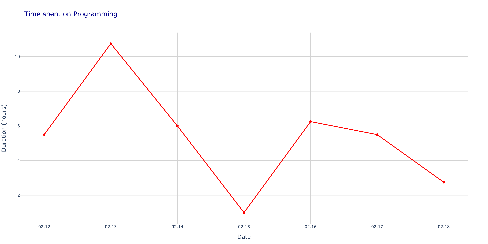

# Google Calendar Analytics


This Python program allows you to perform analytics on your Google Calendar events. With this program, you can visualize
the total duration of your events, compare the length of events across different time periods, and gain insights into
which events take up the most time.

## Features

- Extract events from your Google Calendar
- Compute the total duration of events in a specified time range
- Visualize the duration of events in a pie chart, bar chart, or line chart
- Limit the number of events displayed in the charts
- Save the charts as PNG images

## Example usage:

```python
from datetime import datetime
from google.oauth2.credentials import Credentials

from google_calendar_analytics import AnalyzerFacade

# Example of creds dictionary. (You can get it from Google OAuth2 in you web app)
creds = {
    "token": "ya29.a0AVvZVsoH4qZcrGK25VwsXspJv-r9K-",
    "refresh_token": "1//0hwlhrtalKgeRCgYIARAAGBESNwF-",
    "token_uri": "https://oauth2.googleapis.com/token",
    "client_id": "395np.apps.googleusercontent.com",
    "client_secret": "GOCSPXFqoucE03VRVz",
    "scopes": ["https://www.googleapis.com/auth/calendar"],
    "expiry": "2023-02-18T15:30:15.674219Z"
}

creds = Credentials.from_authorized_user_info(creds)
analyzer = AnalyzerFacade(creds)
start_time = datetime(2023, 2, 1)
end_time = datetime(2023, 2, 15)

# Analyze a single event and generate a chart
event_name = "Meeting"
plot_type = "Line"
fig_1 = analyzer.analyze_one(start_time, end_time, event_name, plot_type)

# Analyze multiple events and generate a chart
max_events = 5
plot_type = "Pie"
fig_2 = analyzer.analyze_many(start_time, end_time, plot_type, max_events)

fig_1.show()
fig_2.show()
```

## Installation

1. You can install the dependencies for this program by running the following command:

```console
pip install -r requirements.txt
```

2. Configure `.env` file by example

### Setup

You will need to create a Google API key to be able to access your Google Calendar data. The instructions for doing this
can be found in the [Google API documentation](https://developers.google.com/calendar/api/guides/quickstart/python).

Once you have obtained your API key, you will need to save it as a JSON file and place it in the `src/authentication/`
directory of the program. The file should be renamed to `credentials.json`

## Usage

To run the program, simply run the following command:

```console
python main.py
```

The program will prompt you for the start and end dates for the time range you would like to analyze. After entering the
dates, the program will compute the total duration of your events and generate pie charts and bar charts that visualize
the duration of your events.

## Contribution

If you would like to contribute to this project, please feel free to submit a pull request. Some areas where
contributions are particularly welcome include:

- Adding new features
- Improving existing features
- Debugging and fixing bugs
- Adding tests to ensure the program is working as expected

## Weekly analytics example:

|              Pie plot               |              Bar plot               |
|:-----------------------------------:|:-----------------------------------:|
|  |  |

|              Line plot               |                        
|:------------------------------------:|
|  | 
 
